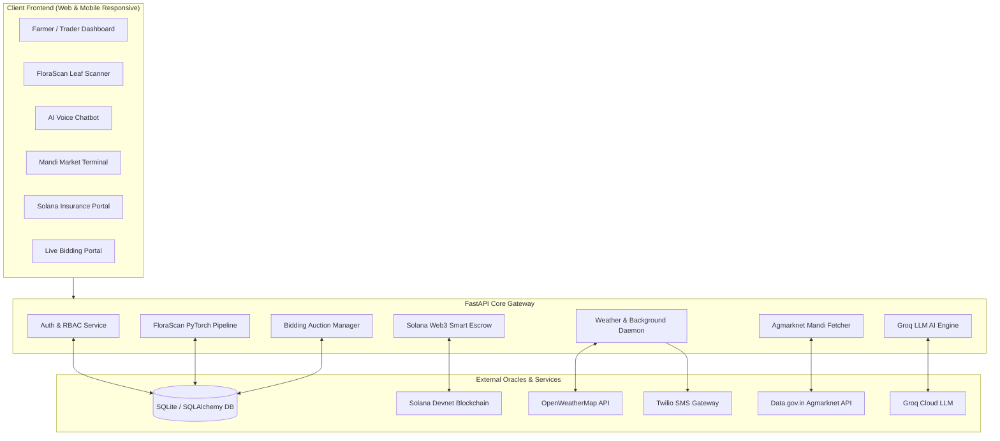

# 🌱 AgriShield AI — Next-Gen AI & Web3 Precision Agriculture Ecosystem

<div align="center">

[](#-hackathon-accolades)
[](https://www.python.org/)
[](https://fastapi.tiangolo.com/)
[](https://pytorch.org/)
[](https://solana.com/)
[](https://groq.com/)
[](https://opensource.org/licenses/MIT)

**An intelligent, climate-resilient precision agriculture operating system combining Deep Learning Computer Vision, Solana Blockchain Parametric Insurance, Groq LLM Advisory, Live Government Mandi Analytics, and Direct Smart Bidding.**

[Features](#-key-features) • [Architecture](#-system-architecture) • [Tech Stack](#-tech-stack) • [Installation](#-quickstart--installation) • [Environment Setup](#-environment-configuration) • [API Docs](#-api-endpoints) • [Hackathon Win](#-hackathon-accolades)

</div>

---

## 🏆 Hackathon Accolades

> **Winner** — **Red Hat Center of Excellence (CoE) @ SIMATS Engineering Hackathon**  
> *Recognized for groundbreaking innovation in bridging Deep Learning AI, Decentralized Web3 Financial Safety Nets, and Real-Time IoT/Climate Intelligence for empowering smallholder farmers.*

---

## 🌾 The Problem & Our Solution

| The Challenge for Farmers | How AgriShield AI Solves It |
|---|---|
| **Pest & Crop Disease Outbreaks** lead to sudden yield loss without timely diagnostic expertise. | **FloraScan AI**: Instant computer-vision leaf disease identification (ResNet/CNN) with curative/preventative remedy prescriptions. |
| **Climate Disasters & Delayed Insurance**: Complex paperwork takes months to settle crop insurance claims. | **Solana Parametric Insurance**: Autonomous weather-oracle smart contracts executing instant wallet payouts when adverse thresholds are crossed. |
| **Middleman Exploitation**: Traders and commission agents suppress farmer sale prices at local mandis. | **Smart Bidding Marketplace**: Transparent, live reverse-auction fair-trade portal connecting verified buyers directly to farmers. |
| **Suboptimal Selling Timing**: Farmers sell at harvest rush when supply is saturated and prices plummet. | **Optimal Selling Calendar**: Predictive demand scheduler aligning harvests with regional festivals (Pongal, Diwali) & muhurtham peaks. |
| **Lack of Localized Real-Time Advice**: Generic weather forecasts fail to provide actionable farm tasks. | **AI Voice Copilot & SMS Dispatch**: Multi-lingual Groq LLM chatbot + automated Twilio emergency weather SMS broadcast engine. |

---

## ✨ Key Features

```
                                  ┌─────────────────────────────────────────┐
                                  │           AGRISHIELD AI ECOSYSTEM       │
                                  └────────────────────┬────────────────────┘
                                                       │
         ┌───────────────────┬─────────────────────────┼─────────────────────────┬───────────────────┐
         │                   │                         │                         │                   │
         ▼                   ▼                         ▼                         ▼                   ▼
 🌿 FloraScan AI     ⛓️ Solana Insurance       🤖 AI Copilot (Groq)     📊 Mandi Market Radar   🤝 Smart Bidding
 (PyTorch ResNet)   (Parametric Escrow)     (Multilingual Voice/Text)  (Live Data.gov.in API) (Direct Farmer-Buyer)
```

### 1. 🌿 FloraScan AI — Plant Pathology & Disease Diagnosis
- Upload leaf photographs to detect diseases in real-time.
- Backed by **PyTorch Deep Convolutional Neural Networks (ResNet18)**.
- Provides confidence scoring, organic remedies, chemical fungicide/pesticide dosage, and prevention strategies.

### 2. ⛓️ Decentralized Parametric Crop Insurance (Solana Blockchain)
- Zero paperwork, automated parametric insurance claims powered by **Solana Devnet / Solders SDK**.
- Escrow pool smart-wallet architecture.
- Automatic claim trigger when adverse weather thresholds (e.g., rainfall < 10mm or temperature > 42°C) are detected by weather oracles.

### 3. 🤖 Agri Copilot — Multilingual AI Farming Assistant
- Powered by ultra-fast **Groq Cloud LPU inference** (Llama 3 / Mixtral).
- Supports localized regional vernaculars and agricultural domain understanding.
- Voice-enabled speech input and voice playback for accessible hands-free in-field usage.

### 4. 📈 Real-Time Agmarknet Mandi Intelligence & MSP Tracker
- Live synchronization with **Government of India Agmarknet API (data.gov.in)**.
- Tracks commodity arrivals, modal prices, min/max price spreads, and historical price volatility.

### 5. 🗓️ Optimal Selling & Festival Profit Calendar
- Algorithmic harvest timing advisor based on seasonal calendar intelligence.
- Flags high-demand windows (Festivals, Wedding Muhurthams) to help farmers harvest and sell when commodity prices peak.

### 6. 🤝 Fair-Trade Smart Bidding Marketplace
- Eliminates predatory middlemen through transparent digital reverse auctions.
- Dedicated dashboards for **Farmers** (create crop listings, set reserve prices, accept bids) and **Buyers/Traders** (place bids, track active auctions).

### 7. 🚨 Automated Weather Engine & Twilio SMS Alert Broadcast
- Background asynchronous daemon (`asyncio.create_task`) running every 30 minutes.
- Monitors rapid atmospheric pressure/temperature anomalies.
- Dispatches emergency SMS alerts directly to farmers' mobile devices via **Twilio**.

---

## 🏗️ System Architecture



---

## 🛠️ Tech Stack

| Layer | Technologies |
|---|---|
| **Backend & API** | **Python 3.10+**, **FastAPI**, Starlette, Uvicorn, Jinja2 |
| **Deep Learning & CV** | **PyTorch**, Torchvision (ResNet18), Pillow, NumPy |
| **Blockchain & Web3** | **Solana Devnet**, `solders`, `solana-py`, Base58, Keypair Cryptography |
| **AI / GenAI** | **Groq Cloud LPU**, Llama 3, Mixtral, Prompt Engineering |
| **External APIs** | **Data.gov.in Agmarknet API**, **OpenWeatherMap**, **Twilio SMS API** |
| **Database & ORM** | **SQLAlchemy**, **SQLite** (expandable to PostgreSQL) |
| **Security & Auth** | **JWT (python-jose)**, **Passlib (Bcrypt)**, Session Middleware |
| **Frontend** | Semantic HTML5, Vanilla CSS3 (Glassmorphism), JavaScript (ES6+), Web Speech API |

---

## 📂 Project Structure

```
AGRI SHIELD AI/
├── app/
│   ├── api/
│   │   ├── advisory/           # Personalized crop advisory & SMS dispatch
│   │   ├── alerts/             # Emergency weather monitor & Twilio alert service
│   │   ├── auth.py             # User signup, login, JWT token auth & hashing
│   │   ├── bidding/            # Reverse auction & marketplace router
│   │   ├── chatbot/            # Groq AI multilingual assistant endpoint
│   │   ├── crop_monitor/       # Soil, stage, and crop health metrics
│   │   ├── flora_scan/         # PyTorch plant disease detection service
│   │   ├── insurance/          # Parametric insurance policy endpoints
│   │   ├── market/             # Agmarknet government mandi price integration
│   │   └── optimal_selling.py  # Festival & harvest window planner
│   ├── blockchain/
│   │   ├── solana_client.py    # Async Solana RPC client (transfers, airdrop, balance)
│   │   └── wallet_manager.py   # Parametric insurance escrow & claim settlement pool
│   ├── core/                   # Security tokens, config & dependencies
│   ├── database.py             # SQLAlchemy engine & session maker
│   ├── main.py                 # FastAPI application root & background daemon
│   ├── models.py               # Database schemas (Users, Policies, Crops, Bids, Alerts)
│   └── schemas.py              # Pydantic request/response validation schemas
├── data/
│   └── calendar_2026.json      # Festival demand and harvest calendar dataset
├── pest and disease/           # PyTorch deep learning dataset & model weights
├── static/                     # CSS stylesheets, frontend JS scripts, assets
├── templates/                  # Jinja2 HTML templates for all dashboards
├── .env.example                # Clean template for all required API keys
├── .gitignore                  # Production-grade git exclusion rules
├── requirements.txt            # Python package dependencies
├── LICENSE                     # MIT Open Source License
└── README.md                   # Project documentation & setup guide
```

---

## 🚀 Quickstart & Installation

### 1. Prerequisites
- **Python 3.10+** installed on your system.
- **Git** installed.
- (Optional) A modern browser with microphone support (Chrome / Edge) for the voice AI assistant.

### 2. Clone the Repository
```bash
git clone https://github.com/Mukesh631102/Agri-Shield-AI.git
cd Agri-Shield-AI
```

### 3. Create and Activate a Virtual Environment

**On Windows (PowerShell / Command Prompt):**
```powershell
python -m venv venv
.\venv\Scripts\activate
```

**On Linux / macOS:**
```bash
python3 -m venv venv
source venv/bin/activate
```

### 4. Install Dependencies
```bash
pip install --upgrade pip
pip install -r requirements.txt
```

### 5. Configure Environment Variables
Copy the `.env.example` file to `.env`:
```bash
cp .env.example .env
```
Open `.env` and fill in your keys (see [Environment Configuration](#-environment-configuration)).

### 6. Launch the Application
```bash
uvicorn app.main:app --reload --host 0.0.0.0 --port 8000
```
Open your browser and navigate to:
👉 **`http://localhost:8000`**

---

## ⚙️ Environment Configuration

Set the following keys in your `.env` file:

| Variable | Description | Source |
|---|---|---|
| `SECRET_KEY` | Secret key for JWT auth and session signing | Any secure random string (32+ chars) |
| `GROQ_API_KEY` | High-speed LLM inference for AI advisory | [Groq Cloud Console](https://console.groq.com/) |
| `AGMARKNET_API_KEY` | Real-time Indian government mandi prices | [Data.gov.in](https://data.gov.in/) |
| `RESOURCE_ID` | Dataset identifier for Agmarknet | `9ef842fd-dd9f-47b5-8c6d-96ed0ea74e7e` |
| `WEATHER_API_KEY` | Live temperature, humidity, rainfall metrics | [OpenWeatherMap](https://openweathermap.org/api) |
| `TWILIO_ACCOUNT_SID` | Twilio account identifier for SMS delivery | [Twilio Console](https://www.twilio.com/) |
| `TWILIO_AUTH_TOKEN` | Twilio authentication token | [Twilio Console](https://www.twilio.com/) |
| `TWILIO_PHONE_NUMBER`| Twilio virtual number (E.164 format) | [Twilio Console](https://www.twilio.com/) |
| `SOLANA_RPC_URL` | Solana network RPC endpoint | Default: `https://api.devnet.solana.com` |

---

## 📡 API Endpoints Overview

| Module | Method | Endpoint | Description |
|---|---|---|---|
| **Auth** | `POST` | `/api/auth/signup` | Register a new farmer or buyer account |
| **Auth** | `POST` | `/api/auth/login` | Authenticate and receive JWT session cookie |
| **AI Assistant** | `POST` | `/api/chat/ask` | Query the Groq agricultural LLM copilot |
| **FloraScan** | `POST` | `/api/flora-scan/predict` | Upload leaf image for PyTorch disease diagnosis |
| **Market** | `GET` | `/api/market/prices` | Fetch live commodity prices from Agmarknet API |
| **Market** | `GET` | `/api/market/commodity/{name}`| Search price history and trends for specific crops |
| **Insurance** | `POST` | `/api/insurance/create` | Purchase parametric insurance policy with Solana escrow |
| **Insurance** | `POST` | `/api/insurance/evaluate-claims`| Oracle trigger evaluating weather anomalies and issuing payouts |
| **Bidding** | `GET` | `/bidding/listings` | Fetch active marketplace crop listings |
| **Bidding** | `POST` | `/bidding/place-bid` | Submit competitive bid on farmer listing |
| **Alerts** | `GET` | `/api/alerts/weather` | Query active weather risk status |

---

## 🗺️ Roadmap

- [x] PyTorch Deep Learning Plant Pathology Model
- [x] Solana Blockchain Parametric Insurance Escrow & Automated Payouts
- [x] Multi-lingual Voice & Text Groq AI Farming Copilot
- [x] Agmarknet Government Mandi Integration
- [x] Automated Twilio Weather SMS Emergency Dispatch
- [x] Direct Smart Bidding Reverse Auction Platform
- [ ] **IoT LoRaWAN Integration**: Direct wireless soil NPK/moisture sensor mesh telemetry
- [ ] **Satellite NDVI Analysis**: Sentinel-2 / Landsat remote sensing crop health heatmaps
- [ ] **Mobile App**: Cross-platform Flutter / React Native build with offline caching

---

## 🤝 Contributing

Contributions are warmly welcomed! Please read our [CONTRIBUTING.md](CONTRIBUTING.md) guide before submitting pull requests.

---

## 📄 License

This project is licensed under the **MIT License** — see the [LICENSE](LICENSE) file for details.

---

<div align="center">

🏆 **Developed with pride for the Red Hat Center of Excellence @ SIMATS Hackathon** 🏆  
*Empowering farmers with the synergy of AI, Web3, and Open Technology.*

</div>
